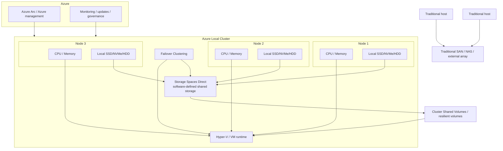

# Storage Spaces Direct in Azure Local

Storage Spaces Direct is the software-defined storage layer inside Azure Local. It pools the local disks attached to each cluster node and presents them as resilient shared storage for the cluster.

In Azure Local, Storage Spaces Direct replaces the role that a traditional external SAN or NAS would normally play. Instead of servers connecting out to a separate storage array, the cluster nodes contribute their own drives and the platform turns them into a shared storage fabric.

## Architecture Diagram

## How It Fits Into Azure Local

Storage Spaces Direct sits inside the Azure Local cluster and provides the shared storage behavior needed by clustered workloads.

The stack is typically understood like this:

1. Azure Local nodes provide CPU, memory, and directly attached disks.
2. Storage Spaces Direct aggregates those local disks into a single storage pool.
3. The platform creates resilient volumes, typically exposed as Cluster Shared Volumes.
4. Hyper-V uses those volumes to run highly available virtual machines and workloads.
5. Failover Clustering coordinates node membership, availability, and workload movement.
6. Azure services such as Azure Arc provide management, governance, monitoring, and lifecycle integration.

## Compared to Traditional Shared Storage

### Traditional Shared Storage Model

1. Compute servers are separate from the storage system.
2. Hosts connect to an external SAN or NAS over a storage network.
3. Shared storage depends on the dedicated storage array and its controllers.
4. Compute and storage are usually scaled as separate layers.

### Azure Local with Storage Spaces Direct

1. Compute and storage are combined in the same cluster nodes.
2. Each node contributes local disks to the cluster.
3. Storage Spaces Direct provides shared storage in software.
4. Resiliency is delivered through mirroring or parity across drives and nodes.
5. Scaling is typically done by adding more nodes to the cluster.

## Why This Matters

Storage Spaces Direct is what makes Azure Local a hyperconverged platform. It gives the cluster the benefits of shared storage without requiring a separate storage appliance.

Key outcomes:

1. Simpler infrastructure with fewer dedicated storage components.
2. High availability for clustered VMs and services.
3. Strong performance from local SSD, NVMe, and HDD resources.
4. Software-defined resiliency for disk and node failures.
5. Unified scaling of compute and storage through cluster expansion.

## Short Summary

In a traditional architecture, storage lives beside the servers in a dedicated array. In Azure Local, Storage Spaces Direct makes the servers themselves become the storage system.